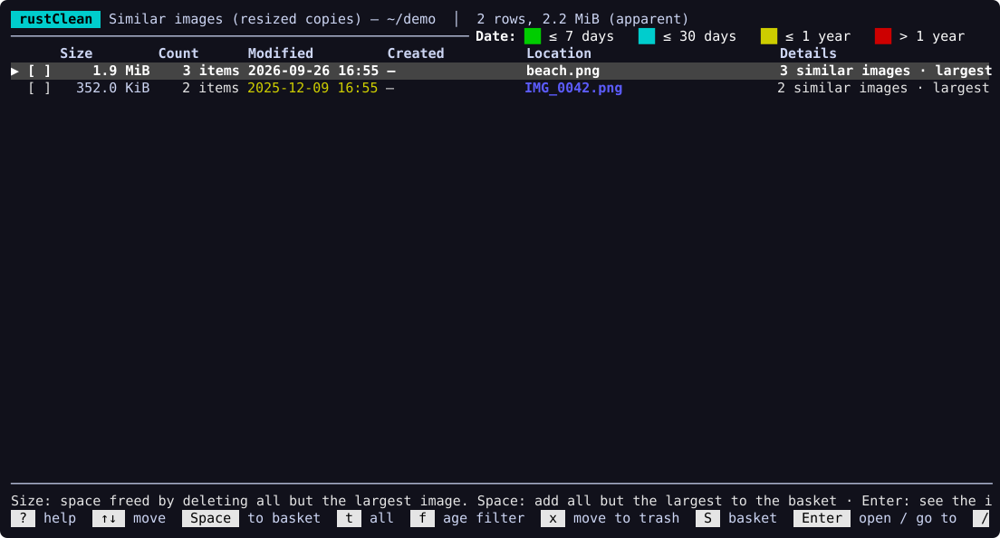

<div align="center">

# rustClean

**A fast terminal disk usage analyzer that also helps you clean up — safely.**

[](https://github.com/hzrbasaran/rustClean/actions/workflows/ci.yml)
[](https://crates.io/crates/rustclean)
[](#license)


English · [Türkçe](README.tr.md)


</div>

rustClean scans a disk or folder in parallel and lets you explore where the
space went — as a sortable list or a treemap — and then act on it: built-in
reports find developer junk, duplicates, empty folders and temporary files,
old large files, caches and the leftovers of apps you removed long ago, and a
basket lets you collect entries from anywhere and move them to the trash in
one go.

## Highlights

- **Fast parallel scan** — ~2 million entries in about 20 seconds on an SSD,
  with compact memory use (~70 bytes per entry). Hard links are counted once,
  other volumes are not crossed, and both *apparent* and *on-disk* sizes are
  tracked.
- **Explore** — a navigable list with size bars, file counts and color-coded
  modification dates, a **treemap** view (`t`), and a per-folder
  **summary** with file types, age distribution and the largest items (`i`).
- **Treemap as a web page** (`w`) — saves the current folder as a single,
  self-contained HTML file with a zoomable treemap four levels deep, to open
  in any browser (also offline, also on a phone) or to share.
- **Reports** (`m`)
  - largest files and folders
  - most repeated file names
  - applications **with their data** (`~/Library`, containers, caches,
    preferences…); `u` uninstalls an app with its data in one step (macOS)
  - **orphaned app leftovers** of apps that are no longer installed
  - **developer junk**: `node_modules`, Cargo `target`, `build`/`dist`,
    `Pods`, `DerivedData`, `.venv`… (only when the project's marker file is
    next to it)
  - cache folders
  - old and large files
  - **installers and archives in Downloads** (`.dmg`, `.pkg`, `.zip`, `.xip`…)
  - **duplicate files** with identical content, keeping the oldest copy
    (never inside an app, a Photos library or a `.git` folder)
  - **similar images**: resized, re-compressed or re-saved copies of the
    same picture (JPEG, PNG, WebP, GIF, TIFF, BMP; not HEIC), keeping the
    largest
  - **empty folders, broken links and temporary files** (`.DS_Store`,
    `*.tmp`, Office locks, unfinished downloads), leaving alone hidden
    folders, bundles, `Library`, build output and system folders
  - **iPhone / iPad backups** made by Finder or iTunes (`MobileSync/Backup`):
    the device, model, iOS version and date of each backup, encrypted ones
    and the newest backup of each device marked; explains when the folder
    needs Full Disk Access
- **Age filter** (`f`) on reports: show only what has not been touched for
  30 / 90 / 180 / 365 days. For developer junk, the age is the *project's*,
  not the dependency folder's.
- **Basket** — collect entries with `Space` anywhere, review them with `S`,
  move them all to the trash with `x`.
- **Export** — `o` saves the list on screen (folder, treemap, summary, any
  report or search) as **CSV or JSON**, with absolute paths, both sizes and
  ISO 8601 dates.
- **Reports from the command line** — `rustclean report dev-junk ~/Projects
  --older 90 --json` prints any report as a table, CSV or JSON, for scripts
  and cron jobs. It only reads; nothing is deleted.
- **Low disk space warning** — `rustclean check` says when the disk with
  your home folder (and any you add) is fuller than 90 %. `rustclean check
  --install` runs it every hour in the background (launchd on macOS, a
  systemd timer on Linux) and shows a notification, at most once a day per
  disk ([details](docs/USAGE.md#disk-space-check)).
- **Deletion log** — everything moved to the trash, by day, with how it was
  deleted (menu → Deletion log).
- **Developer tools cleanup** — measures what Docker, Xcode (simulators,
  DerivedData, archives), the Android SDK (emulators, system images), npm,
  pnpm, Yarn, Bun, pip, uv, conda, Gradle, Maven, Go, Flutter / Dart pub,
  Playwright, CocoaPods, Homebrew and Cargo could free, and runs **their own
  cleanup commands** after you confirm.
  On Linux it also measures the apt, dnf and pacman package caches, the
  systemd journal and disabled snap revisions; on Windows `%TEMP%`,
  `C:\Windows\Temp`, the Windows Update download cache and the Recycle Bin.
  What needs root or administrator rights is shown as a command for you to
  run.
- **Scan history** — every scan is summarized; see what grew since last time.
- **System data panel** (macOS) — APFS volumes, Time Machine local snapshots,
  swap, and why the scan total differs from what the disk reports.
- **Turkish and English** interface (`L` to switch).
- **Themes** for dark and light terminals and a color-blind friendly palette
  (`T` to switch), or no colors at all (`--no-color`, `NO_COLOR`).
- **Help** (`?`) — every key on one screen, the current screen's first.
- **Configuration file** — an optional `config.toml`: folders the scan skips,
  the thresholds of "old and large files" and of the duplicate search, and
  the size and sort order a scan opens with. `rustclean --config` shows where
  it goes and what is in effect
  ([details](docs/USAGE.md#configuration-file)).
- **Optional mouse** (`M`) — click to select a row or a treemap block,
  double-click to open, scroll with the wheel. Off by default, so the
  terminal can still select text; confirmations stay keyboard-only.

## Screenshots

| Treemap | Summary |
|---|---|
|  |  |
| **Reports menu** | **Developer junk untouched for 90+ days** |
|  |  |
| **Duplicate files** | **Similar images** |
|  |  |
| **Basket** | **Empty folders, broken links, temporary files** |
|  |  |
| **Deletion log** | **iPhone / iPad backups** |
|  |  |
| **Saving a list (`o`)** | **Light theme** |
|  |  |
| **Color-blind friendly theme** | **Help (`?`)** |
|  |  |
| **The treemap as a web page (`w`)** | |
|  | |

## Safety first

rustClean deletes nothing on its own:

- Every deletion goes to the **system trash**, never straight to permanent
  removal, and is preceded by a confirmation listing what will be moved.
- Mount points and folders on other volumes are refused.
- Developer tool cleanups show the **exact commands** before running them. They
  are started directly, never through a shell and never with `sudo`. Actions
  that can lose data (Docker volumes, emulators, old Xcode archives) require
  typing `yes`. Cleanups that need root or administrator rights (Linux
  package caches, the journal, snaps, Windows system folders) are only
  shown, for you to run yourself.
- Reports start with nothing selected. Where a guess is involved (which data
  belongs to which app), the report says so and errs on the side of keeping
  things.

Note that moving to the trash does not free space until the trash is emptied.

## Installation

### With Homebrew (macOS, Linux)

```bash
brew install hzrbasaran/tap/rustclean
```

Installs the pre-built binary for Apple Silicon, Intel Macs or Linux x86_64;
`brew upgrade` picks up new releases.

### With Cargo

```bash
cargo install rustclean
```

This needs a recent stable [Rust toolchain](https://rustup.rs) (developed and
tested with Rust 1.99; older ones such as 1.79 cannot build the dependencies).
Run `rustup update` if the build fails.

The image decoders behind the similar images report add about 1.2 MB.
`cargo install rustclean --no-default-features` builds without them (and
without that report).

### Pre-built binaries

Each [GitHub release](https://github.com/hzrbasaran/rustClean/releases) comes
with pre-built binaries for macOS (Apple Silicon and Intel), Linux (x86_64)
and Windows (x86_64), built automatically by CI. Unpack the archive and put
`rustclean` somewhere on your `PATH`.

The macOS binaries are not signed by Apple. If macOS refuses to open a
downloaded binary ("developer cannot be verified"), remove the quarantine flag
once:

```bash
xattr -d com.apple.quarantine rustclean
```

### From source

```bash
git clone https://github.com/hzrbasaran/rustClean
cd rustClean
cargo build --release   # binary: target/release/rustclean
```

## Usage

```bash
rustclean                 # pick a disk to scan
rustclean ~/Projects      # scan a folder directly
rustclean --lang en       # interface language: en or tr (also: L in the app)
rustclean --theme light   # dark, light or colorblind (also: T in the app)
rustclean --no-color      # no colors; NO_COLOR=1 works too
rustclean --list-disks    # list disks and exit
rustclean --summary ~     # scan without the interface and print totals
rustclean --config        # where config.toml goes, and the values in effect

# a report without the interface: a table, or --csv / --json (read-only)
rustclean report dev-junk ~/Projects --older 90 --json
rustclean report largest-files ~ --limit 20 --csv > big.csv

# warn when a disk is fuller than 90 % (exit code 3); --install: every hour
rustclean check
rustclean check --install
```

Report kinds: `largest-files`, `largest-dirs`, `repeated-names`, `apps`,
`orphans`, `dev-junk`, `caches`, `old-big`, `downloads`, `duplicates`,
`similar-images`, `clutter`, `device-backups`. See the [usage guide](docs/USAGE.md#reports-from-the-command-line)
for the options and the columns.

Every screen lists its keys at the bottom. The most important ones:

| Key | Action |
|---|---|
| `↑` `↓` · `Enter` · `⌫` | move · open · go back |
| `t` | list ↔ treemap |
| `w` | save the treemap as an HTML page |
| `i` | summary of the current folder |
| `m` | reports and tools |
| `/` | find by name (`*` and `?` wildcards) |
| `Space` · `S` · `x` | add to basket · show basket · move to trash |
| `f` | age filter (in reports) |
| `s` · `a` | sort · apparent / on-disk size |
| `o` | save the list on screen as CSV or JSON |
| `R` · `r` | refresh the current folder · rescan everything |
| `L` | Türkçe ↔ English |
| `T` | theme: dark → light → color-blind |
| `M` | mouse on / off (off by default) |
| `?` | every key, for the current screen first |
| `q` | quit |

See the [usage guide](docs/USAGE.md) for every screen and report.

### macOS: Full Disk Access

macOS protects some locations (Mail, Safari, `~/Library/Containers`…). Without
permission rustClean cannot read them (they are reported as inaccessible) or
move them to the trash. To include them, add your terminal app under
*System Settings → Privacy & Security → Full Disk Access* and restart it.

## Platform support

rustClean is developed and used on **macOS**. It builds and its tests pass on
**Linux** and **Windows** in CI, but those platforms are less tested in daily
use. Some features are macOS-only: the system data panel, Xcode and simulator
cleanup, and app/data matching through bundle identifiers (Linux and Windows
use simpler name-based matching).

The tools screen has platform-specific rows:
- **Linux:** apt, dnf and pacman package caches, the systemd journal and
  disabled snap revisions. They need root, so rustClean shows the `sudo`
  command instead of running it.
- **Windows:** `%TEMP%` (moved to the Recycle Bin after you confirm; files in
  use are skipped), `C:\Windows\Temp` and the Windows Update download cache
  (measured when readable; the commands for an administrator PowerShell are
  shown), and the Recycle Bin size. Windows support is the least tested;
  reports from real machines are welcome.

`rustclean check --install` sets up a launchd agent on macOS and a systemd
user timer on Linux. On Windows it shows the `schtasks` command to run
instead of registering the task itself.

## Data stored on your computer

rustClean makes no network connections. It writes only:

- scan summaries for the history feature (newest 10 per scanned folder),
- the chosen interface language and theme,
- a log of what was moved to the trash (newest 10 000 entries), and
- when `rustclean check` last notified about each full disk,

in the platform data directory (`~/Library/Application Support/rustClean` on
macOS, `~/.local/share/rustClean` on Linux, `%APPDATA%\rustClean` on Windows).
Set `RUSTCLEAN_DATA_DIR` to use another directory.

The same directory holds `config.toml`, the
[configuration file](docs/USAGE.md#configuration-file). rustClean only reads
it; it exists only if you create it.

`rustclean check --install` also writes one file outside it, removed again
by `--uninstall`: `~/Library/LaunchAgents/io.github.hzrbasaran.rustclean.check.plist`
on macOS, or `rustclean-check.service` and `.timer` in
`~/.config/systemd/user` on Linux.

## Contributing

Contributions are welcome. Please read [CONTRIBUTING.md](CONTRIBUTING.md) and
the [architecture overview](docs/ARCHITECTURE.md). By participating you agree
to follow the [Code of Conduct](CODE_OF_CONDUCT.md). Security issues: see
[SECURITY.md](SECURITY.md).

## License

Licensed under either of

- Apache License, Version 2.0 ([LICENSE-APACHE](LICENSE-APACHE) or
  <https://www.apache.org/licenses/LICENSE-2.0>)
- MIT license ([LICENSE-MIT](LICENSE-MIT) or <https://opensource.org/licenses/MIT>)

at your option.

Unless you explicitly state otherwise, any contribution intentionally
submitted for inclusion in the work by you, as defined in the Apache-2.0
license, shall be dual licensed as above, without any additional terms or
conditions.
