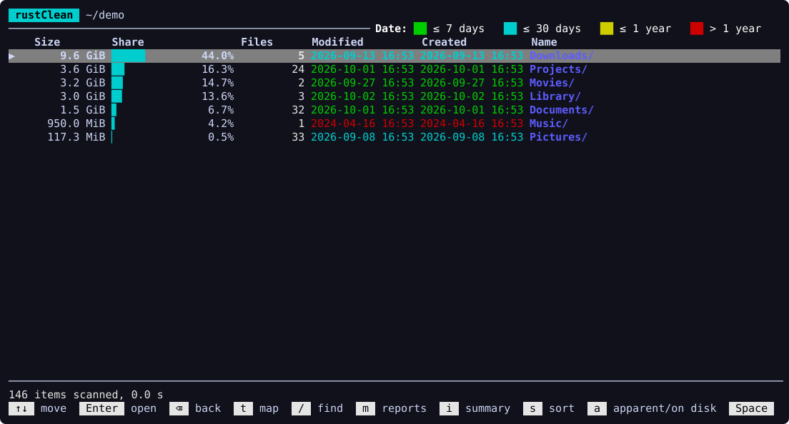
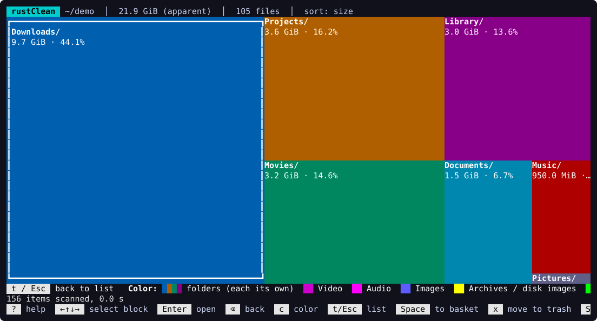
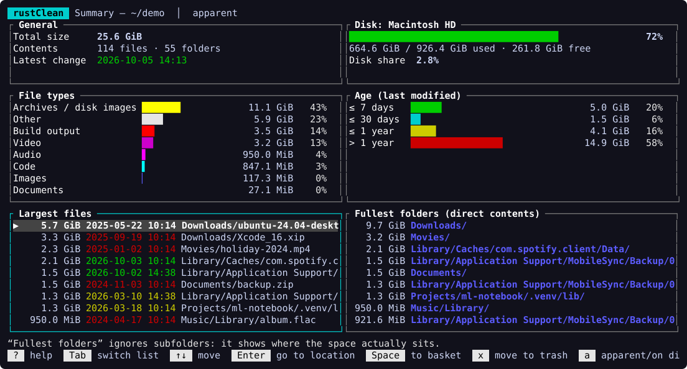
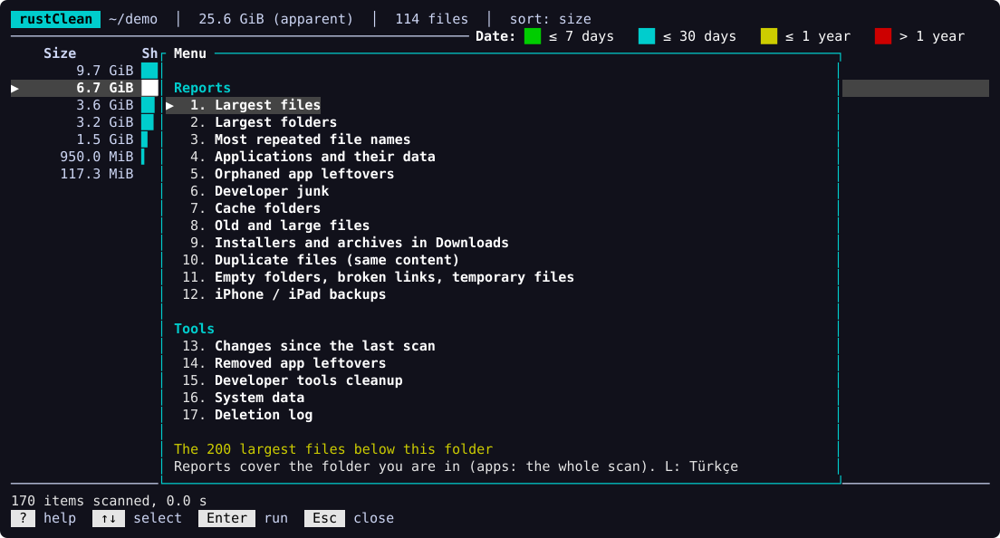
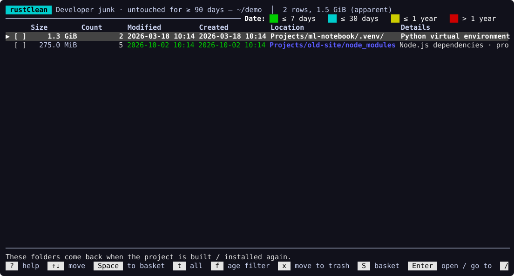
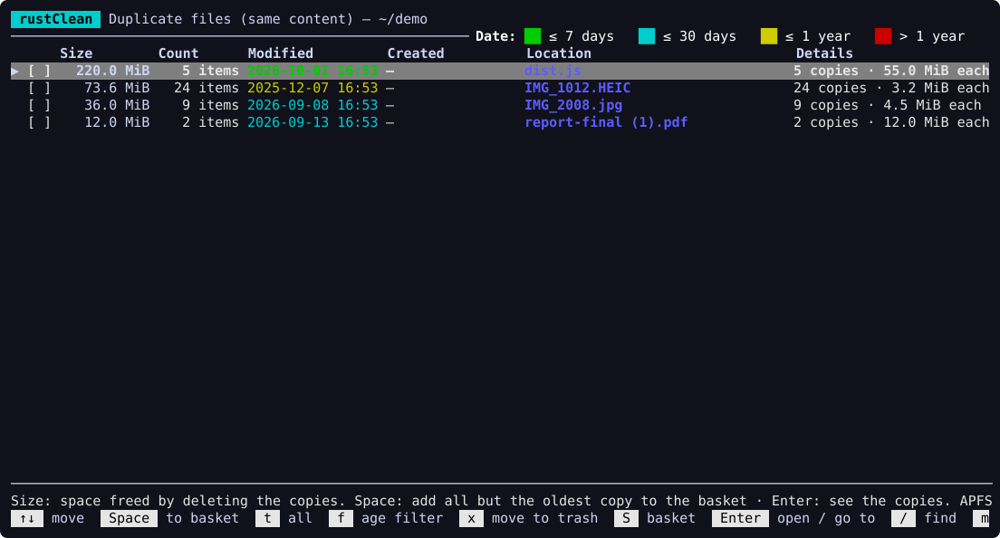
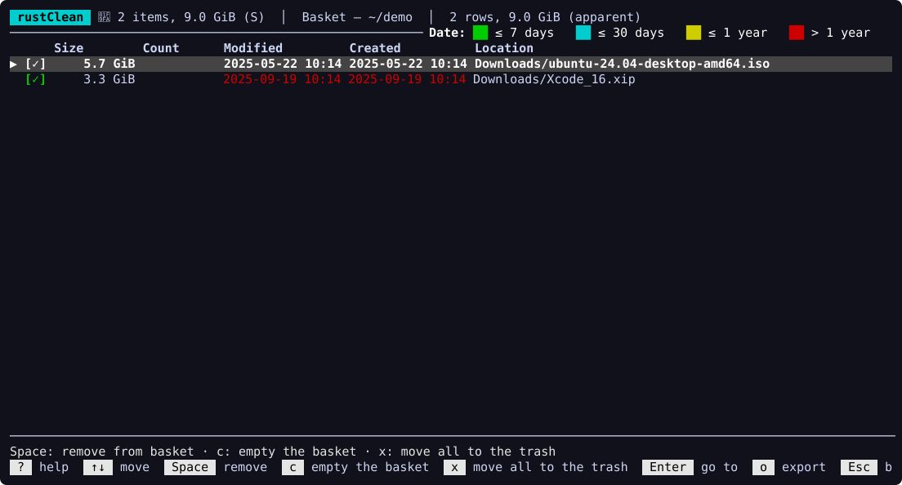

<div align="center">

# rustClean

**A fast terminal disk usage analyzer that also helps you clean up — safely.**

[](https://github.com/hzrbasaran/rustClean/actions/workflows/ci.yml)
[](https://crates.io/crates/rustclean)
[](#license)


English · [Türkçe](README.tr.md)



</div>

rustClean scans a disk or folder in parallel and lets you explore where the
space went — as a sortable list or a treemap — and then act on it: built-in
reports find developer junk, duplicates, empty folders and temporary files,
old large files, caches and the leftovers of apps you removed long ago, and a
basket lets you collect entries from anywhere and move them to the trash in
one go.

## Highlights

- **Fast parallel scan** — ~2 million entries in about 20 seconds on an SSD,
  with compact memory use (~70 bytes per entry). Hard links are counted once,
  other volumes are not crossed, and both *apparent* and *on-disk* sizes are
  tracked.
- **Explore** — a navigable list with size bars, file counts and color-coded
  modification dates, a **treemap** view (`t`), and a per-folder
  **summary** with file types, age distribution and the largest items (`i`).
- **Reports** (`m`)
  - largest files and folders
  - most repeated file names
  - applications **with their data** (`~/Library`, containers, caches,
    preferences…); `u` uninstalls an app with its data in one step (macOS)
  - **orphaned app leftovers** of apps that are no longer installed
  - **developer junk**: `node_modules`, Cargo `target`, `build`/`dist`,
    `Pods`, `DerivedData`, `.venv`… (only when the project's marker file is
    next to it)
  - cache folders
  - old and large files
  - **installers and archives in Downloads** (`.dmg`, `.pkg`, `.zip`, `.xip`…)
  - **duplicate files** with identical content, keeping the oldest copy
- **Age filter** (`f`) on reports: show only what has not been touched for
  30 / 90 / 180 / 365 days. For developer junk, the age is the *project's*,
  not the dependency folder's.
- **Basket** — collect entries with `Space` anywhere, review them with `S`,
  move them all to the trash with `x`.
- **Developer tools cleanup** — measures what Docker, Xcode simulators,
  DerivedData, npm, pnpm, Yarn, pip, Gradle, CocoaPods, Homebrew and Cargo
  could free, and runs **their own cleanup commands** after you confirm.
- **Scan history** — every scan is summarized; see what grew since last time.
- **System data panel** (macOS) — APFS volumes, Time Machine local snapshots,
  swap, and why the scan total differs from what the disk reports.
- **Turkish and English** interface (`L` to switch).
- **Themes** for dark and light terminals and a color-blind friendly palette
  (`T` to switch), or no colors at all (`--no-color`, `NO_COLOR`).

## Screenshots

| Treemap | Summary |
|---|---|
|  |  |
| **Reports menu** | **Developer junk untouched for 90+ days** |
|  |  |
| **Duplicate files** | **Basket** |
|  |  |

## Safety first

rustClean deletes nothing on its own:

- Every deletion goes to the **system trash**, never straight to permanent
  removal, and is preceded by a confirmation listing what will be moved.
- Mount points and folders on other volumes are refused.
- Developer tool cleanups show the **exact commands** before running them. They
  are started directly, never through a shell and never with `sudo`. Actions
  that can lose data (Docker volumes) require typing `yes`.
- Reports start with nothing selected. Where a guess is involved (which data
  belongs to which app), the report says so and errs on the side of keeping
  things.

Note that moving to the trash does not free space until the trash is emptied.

## Installation

### With Homebrew (macOS, Linux)

```bash
brew install hzrbasaran/tap/rustclean
```

Installs the pre-built binary for Apple Silicon, Intel Macs or Linux x86_64;
`brew upgrade` picks up new releases.

### With Cargo

```bash
cargo install rustclean
```

This needs a recent stable [Rust toolchain](https://rustup.rs) (developed and
tested with Rust 1.99; older ones such as 1.79 cannot build the dependencies).
Run `rustup update` if the build fails.

### Pre-built binaries

Each [GitHub release](https://github.com/hzrbasaran/rustClean/releases) comes
with pre-built binaries for macOS (Apple Silicon and Intel), Linux (x86_64)
and Windows (x86_64), built automatically by CI. Unpack the archive and put
`rustclean` somewhere on your `PATH`.

The macOS binaries are not signed by Apple. If macOS refuses to open a
downloaded binary ("developer cannot be verified"), remove the quarantine flag
once:

```bash
xattr -d com.apple.quarantine rustclean
```

### From source

```bash
git clone https://github.com/hzrbasaran/rustClean
cd rustClean
cargo build --release   # binary: target/release/rustclean
```

## Usage

```bash
rustclean                 # pick a disk to scan
rustclean ~/Projects      # scan a folder directly
rustclean --lang en       # interface language: en or tr (also: L in the app)
rustclean --theme light   # dark, light or colorblind (also: T in the app)
rustclean --no-color      # no colors; NO_COLOR=1 works too
rustclean --list-disks    # list disks and exit
rustclean --summary ~     # scan without the interface and print totals
```

Every screen lists its keys at the bottom. The most important ones:

| Key | Action |
|---|---|
| `↑` `↓` · `Enter` · `⌫` | move · open · go back |
| `t` | list ↔ treemap |
| `i` | summary of the current folder |
| `m` | reports and tools |
| `/` | find by name (`*` and `?` wildcards) |
| `Space` · `S` · `x` | add to basket · show basket · move to trash |
| `f` | age filter (in reports) |
| `s` · `a` | sort · apparent / on-disk size |
| `R` · `r` | refresh the current folder · rescan everything |
| `L` | Türkçe ↔ English |
| `T` | theme: dark → light → color-blind |
| `?` | every key, for the current screen first |
| `q` | quit |

See the [usage guide](docs/USAGE.md) for every screen and report.

### macOS: Full Disk Access

macOS protects some locations (Mail, Safari, `~/Library/Containers`…). Without
permission rustClean cannot read them (they are reported as inaccessible) or
move them to the trash. To include them, add your terminal app under
*System Settings → Privacy & Security → Full Disk Access* and restart it.

## Platform support

rustClean is developed and used on **macOS**. It builds and its tests pass on
**Linux** and **Windows** in CI, but those platforms are less tested in daily
use. Some features are macOS-only: the system data panel, Xcode and simulator
cleanup, and app/data matching through bundle identifiers (Linux and Windows
use simpler name-based matching).

## Data stored on your computer

rustClean makes no network connections. It writes only:

- scan summaries for the history feature (newest 10 per scanned folder), and
- the chosen interface language and theme,

in the platform data directory (`~/Library/Application Support/rustClean` on
macOS, `~/.local/share/rustClean` on Linux, `%APPDATA%\rustClean` on Windows).
Set `RUSTCLEAN_DATA_DIR` to use another directory.

## Contributing

Contributions are welcome. Please read [CONTRIBUTING.md](CONTRIBUTING.md) and
the [architecture overview](docs/ARCHITECTURE.md). By participating you agree
to follow the [Code of Conduct](CODE_OF_CONDUCT.md). Security issues: see
[SECURITY.md](SECURITY.md).

## License

Licensed under either of

- Apache License, Version 2.0 ([LICENSE-APACHE](LICENSE-APACHE) or
  <https://www.apache.org/licenses/LICENSE-2.0>)
- MIT license ([LICENSE-MIT](LICENSE-MIT) or <https://opensource.org/licenses/MIT>)

at your option.

Unless you explicitly state otherwise, any contribution intentionally
submitted for inclusion in the work by you, as defined in the Apache-2.0
license, shall be dual licensed as above, without any additional terms or
conditions.
