<div align="center">

# rustClean

**Hızlı bir terminal disk kullanım analizcisi — ve güvenli bir temizlik yardımcısı.**

[](https://github.com/hzrbasaran/rustClean/actions/workflows/ci.yml)
[](https://crates.io/crates/rustclean)
[](#lisans)


[English](README.md) · Türkçe

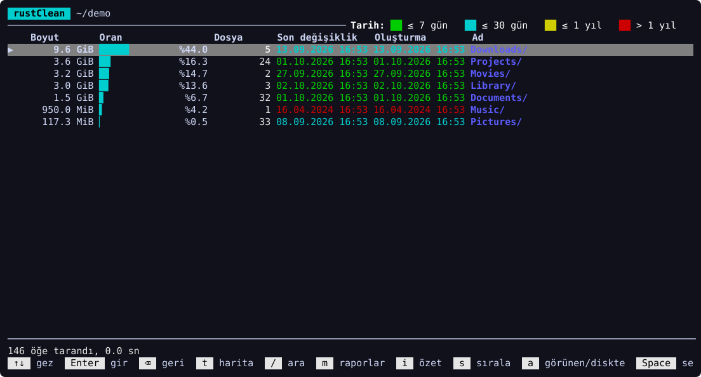

</div>

rustClean bir diski ya da klasörü paralel olarak tarar ve yerin nereye gittiğini
sıralanabilir bir liste veya ağaç haritası (treemap) olarak gösterir. Ardından
harekete geçmenizi sağlar:
- Hazır raporlar geliştirici çöplerini, kopya dosyaları, boş klasörleri ve
  geçici dosyaları, eski büyük dosyaları, önbellekleri ve çoktan kaldırdığınız
  uygulamaların artıklarını bulur.
- Sepet, her yerden öğe toplayıp tek seferde çöp kutusuna taşımanızı sağlar.

## Öne çıkanlar

- **Hızlı paralel tarama:** SSD'de ~2 milyon öğe yaklaşık 20 saniyede taranır;
  bellek kullanımı düşüktür (öğe başına ~70 bayt). Hard link'ler bir kez
  sayılır, başka disklere geçilmez. Hem *görünen* hem *diskte kaplanan* boyut
  tutulur.
- **Keşif:**
  - boyut çubukları, dosya sayıları ve renkli değişiklik tarihleri olan bir liste
  - **ağaç haritası** görünümü (`t`)
  - dosya türleri, yaş dağılımı ve en büyük öğelerle klasör **özeti** (`i`)
- **Raporlar** (`m`):
  - en büyük dosyalar ve klasörler
  - en çok tekrar eden dosya adları
  - **verileriyle birlikte** uygulamalar (`~/Library`, kapsayıcılar,
    önbellekler, tercihler…); `u` bir uygulamayı verisiyle tek adımda
    kaldırır (macOS)
  - artık yüklü olmayan uygulamaların **sahipsiz artıkları**
  - **geliştirici çöpleri:** `node_modules`, Cargo `target`, `build`/`dist`,
    `Pods`, `DerivedData`, `.venv`… (yalnızca projenin işaret dosyası yanındaysa)
  - önbellek klasörleri
  - eski ve büyük dosyalar
  - **İndirilenlerdeki kurulum dosyaları ve arşivler** (`.dmg`, `.pkg`, `.zip`, `.xip`…)
  - içeriği aynı **kopya dosyalar** (en eski kopya korunur)
  - **boş klasörler, kırık bağlantılar ve geçici dosyalar** (`.DS_Store`,
    `*.tmp`, Office kilit dosyaları, yarım indirmeler); gizli klasörlere,
    paketlere, `Library`'ye, derleme çıktılarına ve sistem klasörlerine
    dokunmaz
- **Yaş filtresi** (`f`): Raporlarda yalnızca 30 / 90 / 180 / 365 gündür
  dokunulmamış öğeleri gösterir. Geliştirici çöplerinde yaş, bağımlılık
  klasörünün değil *projenin* yaşıdır.
- **Sepet:** `Space` ile her yerden öğe toplayın, `S` ile gözden geçirin, `x`
  ile hepsini çöp kutusuna taşıyın.
- **Silme kaydı:** çöp kutusuna taşınan her şey, günlere göre ve nasıl
  silindiğiyle (menü → Silme kaydı).
- **Geliştirici araçları temizliği:** Docker, Xcode simülatörleri,
  DerivedData, npm, pnpm, Yarn, pip, Gradle, CocoaPods, Homebrew ve Cargo'nun ne
  kadar yer açabileceğini ölçer; onayınızdan sonra **araçların kendi temizlik
  komutlarını** çalıştırır.
- **Tarama geçmişi:** Her tarama özetlenir; son taramadan beri neyin
  büyüdüğünü görürsünüz.
- **Sistem verileri paneli** (macOS): APFS bölümleri, Time Machine yerel anlık
  görüntüleri, takas ve taranan toplamın diskten neden farklı olduğu.
- **Türkçe ve İngilizce** arayüz (`L` ile değişir).
- Koyu ve açık terminaller için **temalar**, renk körü dostu bir palet
  (`T` ile değişir) ya da hiç renk kullanmama (`--no-color`, `NO_COLOR`).
- **Yardım** (`?`): bütün tuşlar tek ekranda, önce bulunduğunuz ekranınkiler.

## Ekran görüntüleri

| Ağaç haritası | Özet |
|---|---|
| 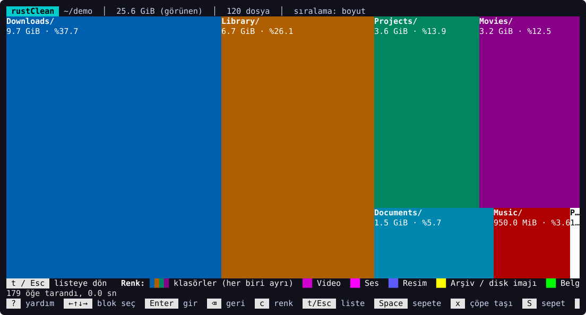 | 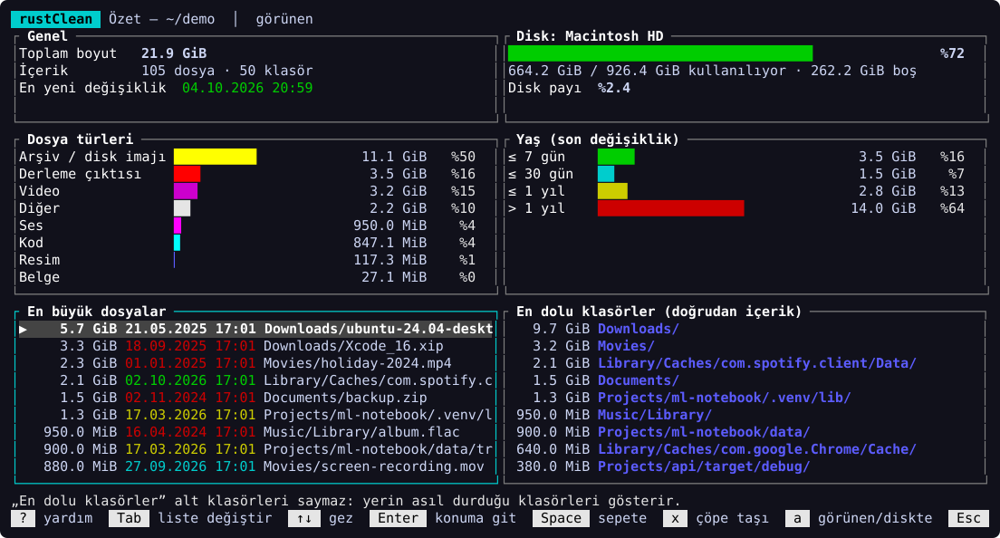 |
| **Rapor menüsü** | **90+ gündür dokunulmamış geliştirici çöpleri** |
| 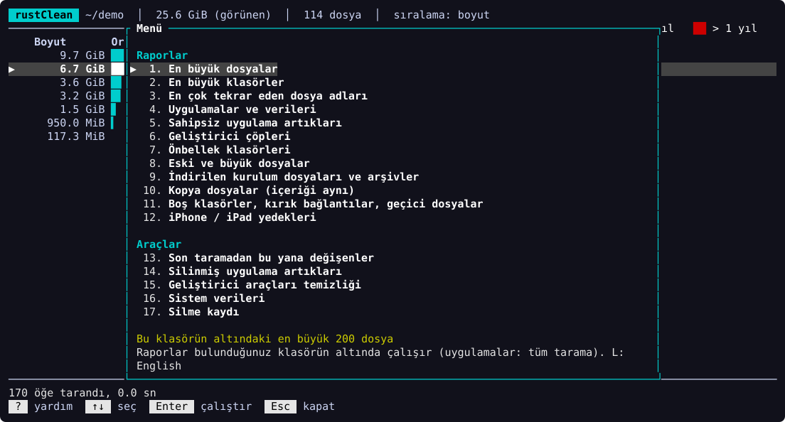 | 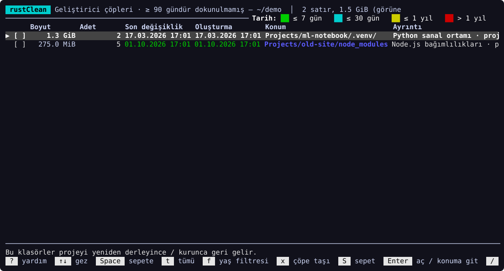 |
| **Kopya dosyalar** | **Sepet** |
| 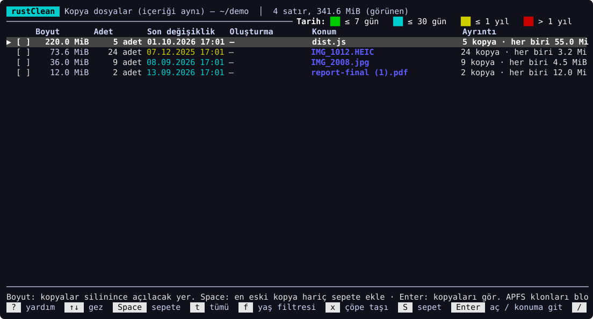 | 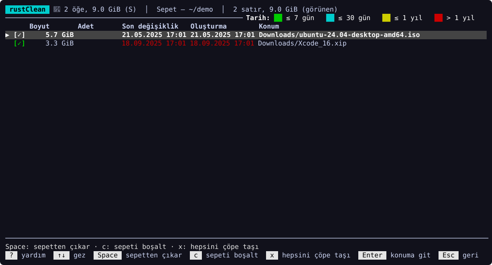 |
| **Boş klasörler, kırık bağlantılar, geçici dosyalar** | **Silme kaydı** |
| 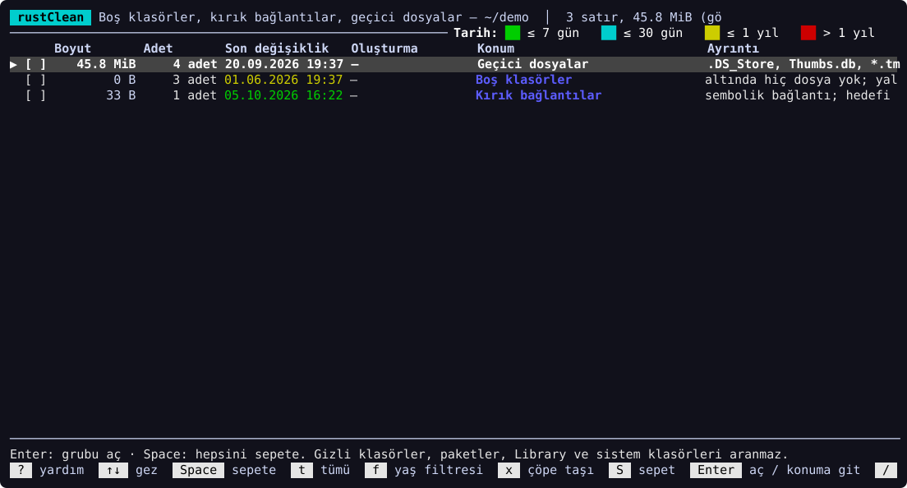 | 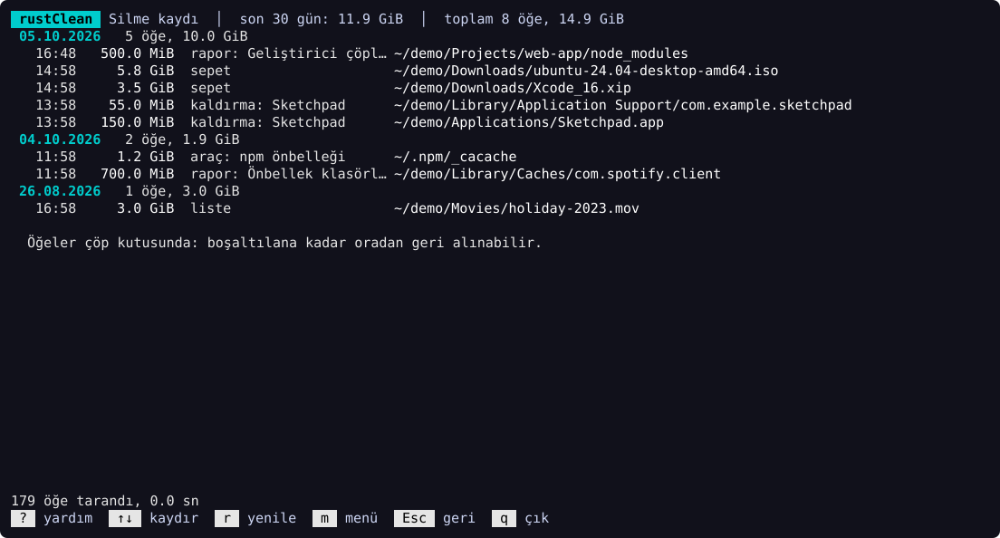 |
| **Açık tema** | **Renk körü dostu tema** |
| 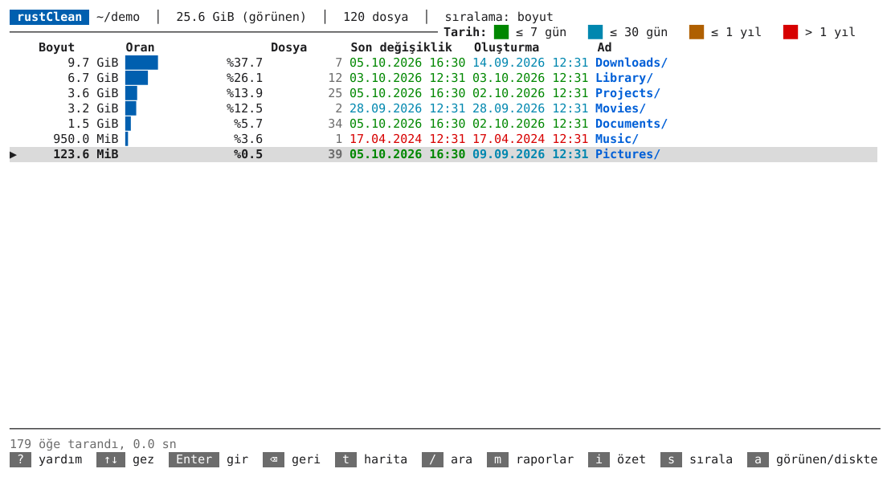 | 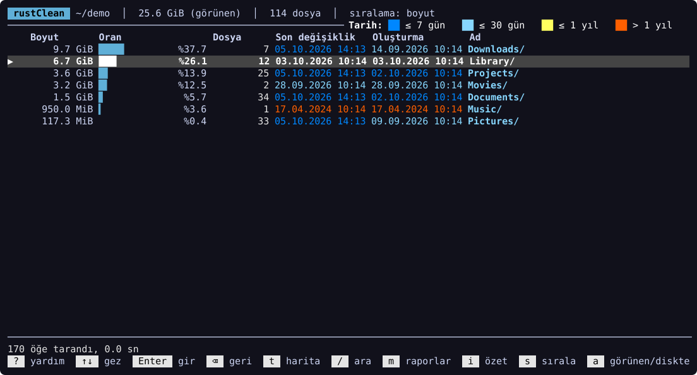 |
| **Yardım (`?`)** | |
| 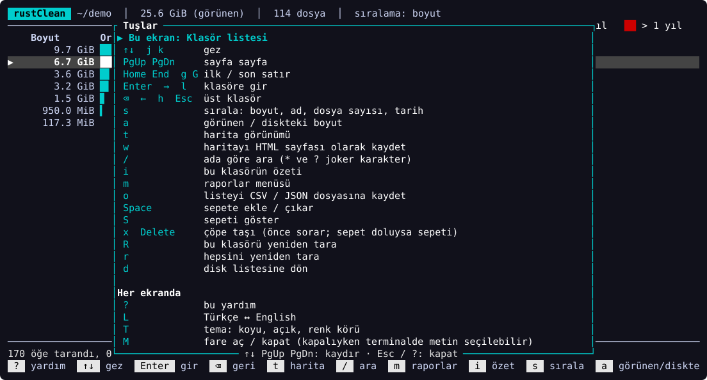 | |

## Önce güvenlik

rustClean kendiliğinden hiçbir şey silmez:

- Her silme **sistem çöp kutusuna** gider, asla doğrudan kalıcı olarak
  silinmez. Öncesinde taşınacakları listeleyen bir onay penceresi açılır.
- Disk bağlama noktaları ve başka disklerdeki klasörler reddedilir.
- Geliştirici araçları temizliği çalıştıracağı **komutları birebir** gösterir.
  Komutlar kabuk üzerinden değil doğrudan ve asla `sudo` ile çalıştırılmaz.
  Veri kaybettirebilecek işlemler (Docker volume'ları) için `evet` yazmak
  gerekir.
- Raporlarda başta hiçbir şey seçili değildir. Tahmin içeren yerlerde (hangi
  verinin hangi uygulamaya ait olduğu) rapor bunu açıkça söyler ve şüphede
  silmemekten yana karar verir.

Çöp kutusuna taşımak yer açmaz; yer, çöp kutusu boşaltılınca açılır.

## Kurulum

### Homebrew ile (macOS, Linux)

```bash
brew install hzrbasaran/tap/rustclean
```

Apple Silicon, Intel Mac ya da Linux x86_64 için hazır derlemeyi kurar; yeni
sürümler `brew upgrade` ile gelir.

### Cargo ile

```bash
cargo install rustclean
```

Güncel bir kararlı [Rust](https://rustup.rs) sürümü gerekir (Rust 1.99 ile
geliştirildi ve test edildi; 1.79 gibi eski sürümler bağımlılıkları
derleyemez). Derleme başarısız olursa `rustup update` çalıştırın.

### Hazır derlemeler

Her [GitHub sürümü](https://github.com/hzrbasaran/rustClean/releases) CI
tarafından otomatik derlenen macOS (Apple Silicon ve Intel), Linux (x86_64) ve
Windows (x86_64) dosyalarıyla gelir. Arşivi açıp `rustclean` dosyasını
`PATH` içindeki bir klasöre koyun.

macOS dosyaları Apple tarafından imzalı değildir. macOS indirilen dosyayı
açmayı reddederse ("geliştirici doğrulanamadı"), karantina işaretini bir kez
kaldırın:

```bash
xattr -d com.apple.quarantine rustclean
```

### Kaynaktan

```bash
git clone https://github.com/hzrbasaran/rustClean
cd rustClean
cargo build --release   # çalıştırılabilir dosya: target/release/rustclean
```

## Kullanım

```bash
rustclean                 # taranacak diski seçin
rustclean ~/Projects      # bir klasörü doğrudan tarayın
rustclean --lang tr       # arayüz dili: tr ya da en (programda: L)
rustclean --theme light   # dark, light ya da colorblind (programda: T)
rustclean --no-color      # renksiz; NO_COLOR=1 de olur
rustclean --list-disks    # diskleri listeleyip çık
rustclean --summary ~     # arayüz açmadan tarayıp toplamları yazdır
```

Her ekranın alt satırında o ekranın tuşları yazar. En önemlileri:

| Tuş | İşlev |
|---|---|
| `↑` `↓` · `Enter` · `⌫` | gezin · aç · geri |
| `t` | liste ↔ ağaç haritası |
| `i` | bulunulan klasörün özeti |
| `m` | raporlar ve araçlar |
| `/` | ada göre ara (`*` ve `?` joker karakterleri) |
| `Space` · `S` · `x` | sepete ekle · sepeti göster · çöpe taşı |
| `f` | yaş filtresi (raporlarda) |
| `s` · `a` | sırala · görünen / diskte boyut |
| `R` · `r` | bulunulan klasörü yenile · tümünü yeniden tara |
| `L` | Türkçe ↔ English |
| `T` | tema: koyu → açık → renk körü dostu |
| `?` | bütün tuşlar, önce bulunduğunuz ekranınkiler |
| `q` | çık |

Tüm ekranlar ve raporlar için [kullanım kılavuzu](docs/USAGE.md) (İngilizce).

### macOS: Tam Disk Erişimi

macOS bazı konumları korur (Mail, Safari, `~/Library/Containers`…). İzin
olmadan rustClean bunları okuyamaz (erişilemeyen olarak raporlanır) ve çöpe
taşıyamaz. Dahil etmek için terminal uygulamanızı *Sistem Ayarları → Gizlilik ve
Güvenlik → Tam Disk Erişimi* bölümüne ekleyip terminali yeniden başlatın.

## Platform desteği

rustClean **macOS** üzerinde geliştirilir ve kullanılır. **Linux** ve
**Windows**'ta CI'da derlenir ve testleri geçer, ancak bu platformlar günlük
kullanımda daha az denenmiştir. Bazı özellikler yalnızca macOS'ta vardır:
- sistem verileri paneli
- Xcode ve simülatör temizliği
- paket kimliğiyle uygulama/veri eşleştirmesi (Linux ve Windows'ta daha basit,
  ada dayalı eşleştirme kullanılır)

## Bilgisayarınızda saklanan veriler

rustClean hiçbir ağ bağlantısı kurmaz. Yalnızca şunları yazar:

- geçmiş özelliği için tarama özetleri (taranan her klasör için en yeni 10),
- seçilen arayüz dili ve tema, ve
- çöp kutusuna taşınanların kaydı (en yeni 10 000 öğe).

Bunlar platformun veri klasöründe tutulur: macOS'ta
`~/Library/Application Support/rustClean`, Linux'ta `~/.local/share/rustClean`,
Windows'ta `%APPDATA%\rustClean`. Başka bir klasör için `RUSTCLEAN_DATA_DIR`
ortam değişkenini kullanın.

## Katkı

Katkılarınızı bekliyoruz. Lütfen [CONTRIBUTING.md](CONTRIBUTING.md) ve
[mimari özetini](docs/ARCHITECTURE.md) okuyun (İngilizce). Katılarak
[Davranış Kuralları](CODE_OF_CONDUCT.md)'na uymayı kabul etmiş olursunuz.
Güvenlik sorunları için [SECURITY.md](SECURITY.md).

## Lisans

İsteğinize bağlı olarak aşağıdakilerden biriyle lisanslanmıştır:

- Apache License 2.0 ([LICENSE-APACHE](LICENSE-APACHE))
- MIT lisansı ([LICENSE-MIT](LICENSE-MIT))

Aksini açıkça belirtmediğiniz sürece, Apache-2.0 lisansında tanımlandığı
şekliyle esere dahil edilmek üzere gönderdiğiniz her katkı, ek koşul olmaksızın
yukarıdaki gibi çift lisanslı olur.
