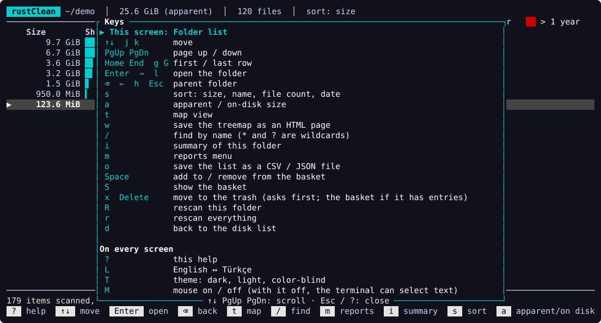
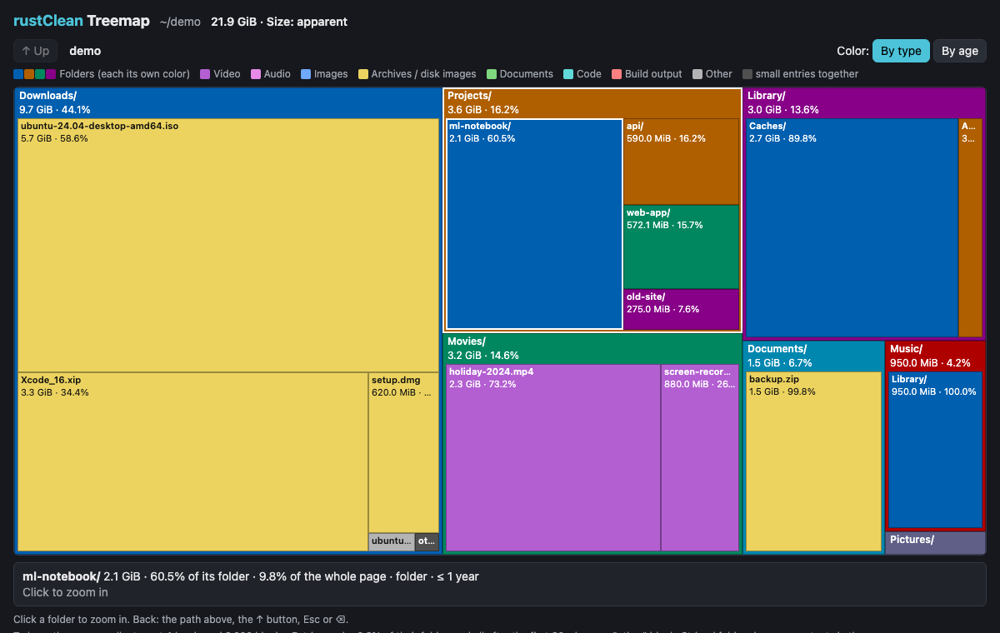
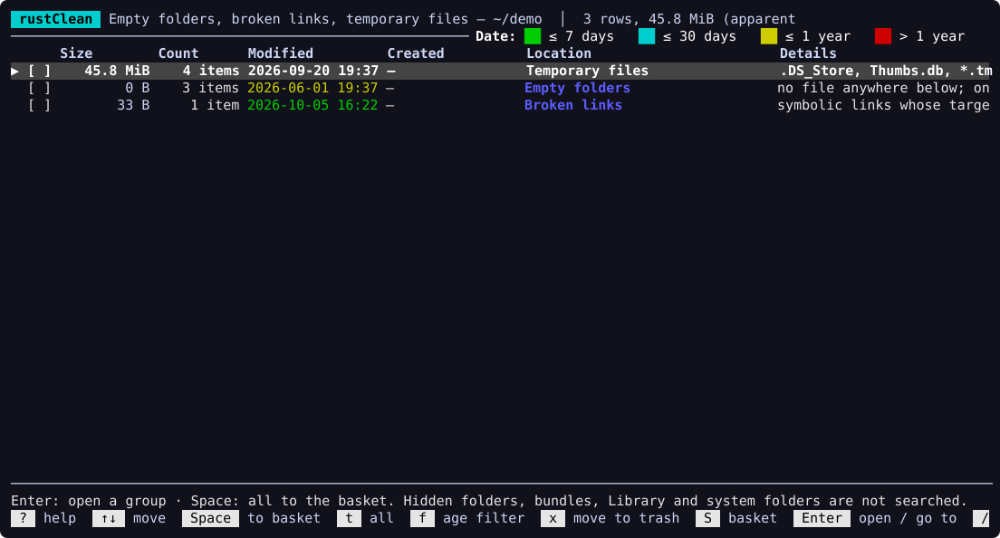
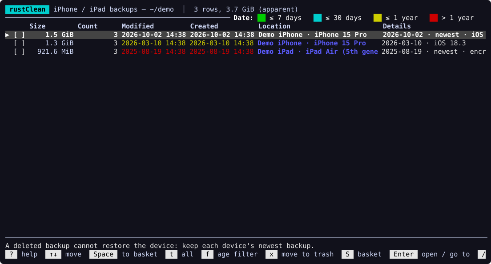
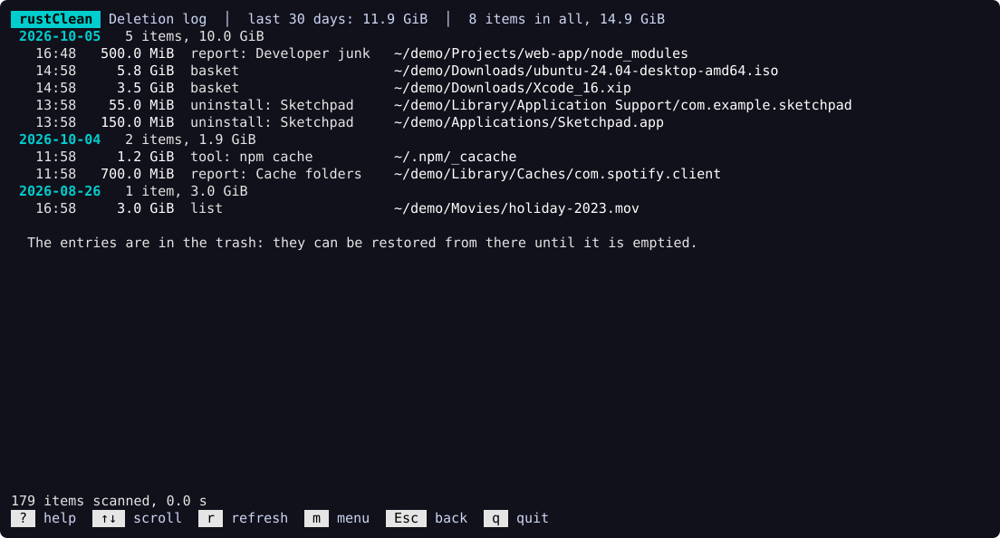
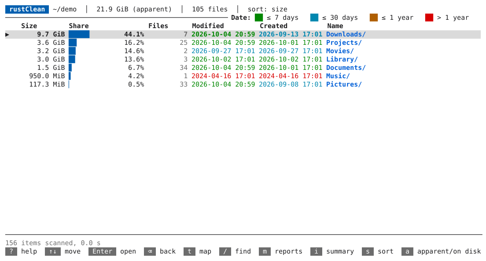
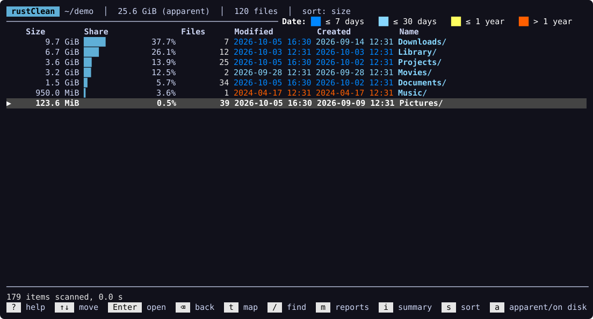
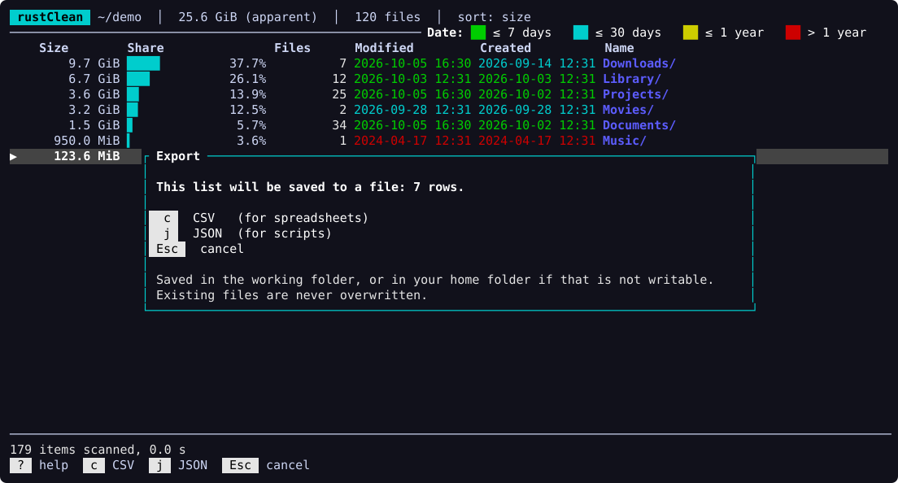

# Usage guide

This guide walks through every screen of rustClean. Each screen also lists its
most used keys on the bottom line, and `?` lists all of them, so you rarely
need to look anything up.

- [Starting](#starting)
- [Browsing](#browsing)
- [Treemap](#treemap)
- [Summary](#summary)
- [Finding by name](#finding-by-name)
- [The basket and deleting](#the-basket-and-deleting)
- [Reports](#reports)
- [Tools](#tools)
- [Language](#language)
- [Deletion log](#deletion-log)
- [Themes and colors](#themes-and-colors)
- [Saving a list (CSV / JSON)](#saving-a-list-csv--json)
- [Reports from the command line](#reports-from-the-command-line)
- [Mouse](#mouse)
- [Command line](#command-line)
- [Configuration file](#configuration-file)

## Starting

Run `rustclean` without arguments to get the list of disks with their usage;
pick one with `Enter`. Or pass a folder: `rustclean ~/Projects`.

Scanning shows live progress (files, folders, size, inaccessible entries).
`Esc` cancels it. Scanning a whole disk with millions of files takes a minute
or two on an SSD.

`?` on any screen lists every key: the current screen's first, then the keys
that work everywhere, then the other screens. The bottom line always starts
with `?  help` and shows the most used keys.



### Keys that work the same everywhere

| Key | Action |
|---|---|
| `↑` `↓` or `j` `k` | move |
| `PgUp` `PgDn` | move a page |
| `Home` `End` or `g` `G` | first / last row |
| `Enter`, `→` or `l` | open (a folder, a group, a report) |
| `⌫`, `←`, `h` or `Esc` | back |
| `x` or `Delete` | move to the trash; always asks first |
| `e` or `y` | yes, in a question (Turkish *evet* / English *yes*; both work in either language) |
| `h`, `n` or `Esc` | no |
| `m` | the menu of reports and tools |
| `o` | save the list on screen as CSV or JSON ([more](#saving-a-list-csv--json)) |
| `?` | every key |
| `L` · `T` | Türkçe ↔ English · theme |
| `M` | mouse on / off; see [Mouse](#mouse) |
| `q` or `Ctrl-C` | quit |

## Browsing

The list shows the current folder's entries with:

- **Size** and a **share** bar relative to the folder.
- **Files**: how many files a folder contains.
- **Modified / Created**: for folders, *Modified* is the newest change of
  anything inside, so long-untouched folders stand out. Dates are colored by
  age (≤ 7 days, ≤ 30 days, ≤ 1 year, older), as the legend on the top line
  shows: green, cyan, yellow and red in the dark theme, blue to vermilion in
  the [color-blind friendly theme](#themes-and-colors).
- **Name**: folders end with `/`; a `✓` marks entries in the basket.

| Key | Action |
|---|---|
| `↑` `↓` `PgUp` `PgDn` `g` `G` | move |
| `Enter` / `→` / `l` | open a folder |
| `⌫` / `←` / `h` / `Esc` | back to the parent folder |
| `s` | sort: size → name → file count → oldest change first |
| `a` | apparent size (file length) ↔ size on disk (what `du` reports; on APFS, pure clones are counted once) |
| `R` | rescan only the current folder (e.g. after a cleanup), in the background; `Esc` cancels |
| `r` | rescan everything from the root |
| `o` | save the list as CSV or JSON ([more](#saving-a-list-csv--json)) |
| `d` | back to the disk list |
| `w` | save the treemap of this folder as an HTML page ([below](#saving-the-treemap-as-a-web-page)) |

## Treemap

`t` switches between the list and a treemap of the current folder. Block area
is proportional to size; entries too small for their own block share the
strip at the bottom ("other"). The selection is shared with the list.

| Key | Action |
|---|---|
| arrow keys or `h` `j` `k` `l` | move to the neighboring block |
| `Enter` / `⌫` | open a folder / go back |
| `c` | color by type (folders each get their own color) or by age |
| `t` / `Esc` | back to the list |
| `o` | save the folder's entries as CSV or JSON |
| `w` | save as an HTML page (see below) |

`Enter` on the "other" strip opens the list at the first small entry.

### Saving the treemap as a web page

`w`, in the list or the treemap, writes the current folder as a web page:
`rustclean-treemap-YYYYMMDD-HHMMSS.html` in the folder rustClean was started
from, or in your home folder if that one cannot be written. An existing file
is never replaced; the name gets `-1`, `-2`, … instead. The status line shows
where the file went.

The page is a single, self-contained file: the data, the script and the
styles are inside it, and it makes no network requests and loads no other
files (a Content Security Policy forbids it). It works offline in current
browsers, also on a phone, and can be shared as it is. It only shows; it
changes nothing.



- Click a folder to zoom in; the path at the top, the **↑** button, `Esc` or
  `⌫` go back. Folders big enough show their contents one level down.
- Each block shows its name, size and share of its folder; hovering (or
  tapping a file) shows the share of the whole page, the type and the age.
- **By type** / **By age** switch the colors as `c` does in the terminal.
- Sizes follow the size mode of the list when you pressed `w` (`a`:
  apparent or on disk), and the texts follow the current language.

To keep the file small on a full disk, the page holds at most **4 levels**
below the folder and **3,000 blocks**. Entries under 0.2 % of their folder,
and all after the 60 largest, share an "other" block per folder. When the
block budget runs out, the deepest and smallest folders are left without
their contents; such folders, and those at the depth limit, are striped.
The page says these limits at the bottom.

## Summary

`i` shows a summary of the current folder:
- totals and the disk it is on
- **file types** (video, archives, build output, …)
- **age** distribution
- the **largest files**
- the **fullest folders**

"Fullest folders" ranks folders by the files *directly* inside them. Ranking by
total size would only list chains of nested parents.

`Tab` switches between the two lists, `Enter` goes to the entry, `Space`/`x`
work as everywhere else. `o` saves the focused list as CSV or JSON.

## Finding by name

`/` searches the current folder and everything below it. The match ignores
case:
- `deneme` matches the whole name exactly
- `deneme*` matches names starting with it
- `*.log` matches all `.log` files
- `test?` matches one extra character

Contents of a matching folder are not listed separately, since moving the
folder moves them too.

## The basket and deleting

- `Space` adds the entry under the cursor to the basket, or removes it. This
  works in the list, the treemap, the summary lists and every result list.
  `t` in a result list adds all its rows.
- The header shows the basket's size: `🧺 3 items, 1.2 GiB (S)`.
- `S` shows the basket. There, `Space` removes an entry and `c` empties the
  basket.
- `x` moves **the whole basket** to the trash after a confirmation. If the
  basket is empty, `x` acts on the entry under the cursor instead.

A folder in the basket covers everything below it, so nothing is counted or
trashed twice.

If some entries cannot be moved (for example protected locations without Full
Disk Access, or locked files), a dialog lists each one with the full error and
what to do about it.

## Reports

`m` opens the menu. Below its list it says what the selected item does. On
a small terminal the list scrolls with the selection, and "▲ 3 more items" /
"▼ 5 more items" say how much is out of view. Reports cover the folder you
are in. Rows start
unselected. `Enter` opens a group or goes to an entry, and `Esc` goes back.
`o` saves the report as CSV or JSON ([more](#saving-a-list-csv--json)), and
`rustclean report` prints any of them without the interface
([more](#reports-from-the-command-line)).

| Report | What it lists |
|---|---|
| Largest files | the 200 largest files |
| Largest folders | by total size, skipping folders that merely wrap one big subfolder |
| Most repeated file names | names that occur most often; `Enter` lists the files |
| Applications and their data | each app with its data folders in `~/Library` (support, caches, containers, logs…) and preference files; the whole scan is used; `u` uninstalls |
| Orphaned app leftovers | data folders that belong to no installed app (installed apps are read from `/Applications` as well, so scanning your home folder is enough) |
| Developer junk | `node_modules`, Cargo `target`, `build`, `dist`, `Pods`, `.build`, `DerivedData`, `.gradle`, `.venv`, `__pycache__`, `vendor`, .NET `bin`/`obj`… only when the project's marker file is present |
| Cache folders | entries of `Caches` / `.cache`, and `GPUCache`, `Code Cache`… |
| Old and large files | ≥ 100 MiB and unchanged for over a year (both [configurable](#configuration-file)) |
| Installers and archives in Downloads | disk images (`.dmg`, `.iso`…), installers (`.pkg`, `.msi`, `.deb`…) and archives (`.zip`, `.xip`, `.tar.gz`…) in `Downloads` folders below the current one (or in the current folder when it is inside `Downloads`) |
| Duplicate files | files with identical content (≥ 1 MiB, [configurable](#configuration-file)); `Space` on a group adds all but the oldest copy |
| Empty folders, broken links, temporary files | three groups: folders with nothing below them (only the topmost is listed), symbolic links whose target is gone, and temporary files (`.DS_Store`, `Thumbs.db`, `*.tmp`, Office `~$…` locks, unfinished downloads) untouched for a day; `Enter` opens a group, `Space` adds it whole |
| iPhone / iPad backups | one row per backup folder in `MobileSync/Backup`: the device name and model, then the date of the backup, `newest` on the newest backup of each device, `encrypted`, and the iOS version, read from the backup's `Info.plist` and `Manifest.plist`; see below |

**Age filter.** In most reports `f` cycles a minimum age: none → 30 → 90 → 180
→ 365 days since the last change. For developer junk the age is the
project's (the newest change next to the junk folder), so a freshly reinstalled
`node_modules` in an abandoned project still counts as old.

**Uninstalling an app** (macOS). In "Applications and their data", `u` on an
app (or inside its group) lists the bundle and every data folder and
preference file matched to it, all checked. `Space` unchecks an entry, `t`
toggles all, and `e` (or `y`) moves the checked ones to the trash. Apps under
`/System` are refused. If the app is running, the dialog says so; quit it first. The
report is listed again afterwards. Preference files
(`~/Library/Preferences/<bundle id>….plist`, also `ByHost`) are matched by
bundle id only.

**Leftovers are a best guess.** Matching data folders to apps uses names and
bundle identifiers. The report excludes shared and system folders and
anything that looks like it belongs to an installed app. Still, look inside
(`Enter`) before deleting.

**What the clutter report leaves alone.** Nothing is lost by removing an
empty folder or a broken link, unless something expects it. So the report
does not look inside hidden folders (a fresh repository's `.git/refs` is
empty and needed), app and package bundles (`.app`, `.framework`,
`.photoslibrary`…), `Library`, `AppData`, build output and dependencies
(`target`, `Pods`, `node_modules`, `vendor`…) and system folders,
and it never lists the standard folders of your home folder (`Desktop`,
`Documents`, `Downloads`…). A folder that holds only such a folder is not
empty. Neither is a folder rustClean could not look into (no permission,
another disk, or a skipped path), nor one around it: it may hold anything.
Temporary files changed in the last day may be in use (an open
document's lock file, a running download) and are left out; `.DS_Store` and
`Thumbs.db` are listed at any age, as the system writes them again.



**iPhone / iPad backups.** Finder (and iTunes before it) keeps device backups
in `~/Library/Application Support/MobileSync/Backup`; on Windows, iTunes and
Apple Devices use `%APPDATA%\Apple Computer\MobileSync\Backup` or
`%USERPROFILE%\Apple\MobileSync\Backup`. Each backup is one folder, often
tens of GB. Scan your home folder to see them. The age filter (`f`) goes by
the date of the backup, not by the folder's last change.

A deleted backup cannot restore the device. Keep the newest backup of each
device (marked `newest`) unless the device is gone or backs up to iCloud;
older ones, and those of devices you no longer have, are the usual
candidates. `x` and the basket move a backup to the trash as usual, so it
can still be put back until the trash is emptied.



On macOS the backup folder is protected: without Full Disk Access the scan
sees it empty, and the report says so instead of listing nothing. To grant
it, open System Settings → Privacy & Security → Full Disk Access, turn on
your terminal app (Terminal, iTerm, …; add it with `+` if it is not listed),
restart the terminal and scan again. When the scan does not include the
backup folder at all (you scanned another folder), the report says to scan
your home folder.

**Duplicates and APFS.** Copies that are APFS clones (made by `cp -c`, Finder's
Duplicate and many apps) share their blocks. The group's detail says how many
copies are clones, and deleting them frees nothing. In disk size mode the
group's size already leaves them out.

## Tools

**Changes since the last scan.** Every completed scan is summarized and the
newest 10 per folder are kept. Pick a saved scan to see what grew, shrank or
appeared below the current folder. The removed entries are summarized at the
bottom.

**Removed app leftovers.** The same report as "Orphaned app leftovers".

**Developer tools cleanup.** Measures, read-only, what each installed tool
could free, then lets you choose actions. Each one carries its risk as a
label (and a color: green, yellow, red in the dark theme; blue, orange,
vermilion in the color-blind friendly one):
- **safe**: nothing of value is lost
- **re-downloaded**: comes back by downloading or building again
- **DATA LOSS**: may delete your data

The confirmation shows the exact commands. Data-loss actions require typing
`yes` (`evet` in Turkish) and `Enter`. Commands run one after another with their output in a
log. The tool is then measured again.

| Tool | Actions |
|---|---|
| Docker | stopped containers + dangling images + build cache (safe) · all unused images (re-downloaded) · unused volumes (data loss) |
| Xcode simulators | delete unavailable simulators (safe) · delete individual runtimes (re-downloaded) · delete simulators never used (safe) or not used for over a year (data loss: their app data), all at once or one by one |
| DerivedData / DeviceSupport | move contents to the trash (safe) |
| Xcode archives | move archives older than 12 months to the trash (data loss) |
| npm · pnpm · Yarn · pip | the tool's own cache commands (re-downloaded; `pnpm store prune` is safe) |
| uv | `uv cache clean` (re-downloaded) |
| conda | `conda clean --all --yes` (re-downloaded) |
| Bun | move the global cache to the trash (re-downloaded) |
| Gradle | stop daemons, move the cache to the trash (re-downloaded) |
| Maven | move `~/.m2/repository` to the trash (re-downloaded) |
| Go | `go clean -modcache` (re-downloaded) · `go clean -cache` (safe) |
| Flutter / Dart pub | `flutter pub cache clean --force` (re-downloaded) |
| Playwright | move the browsers folder's contents to the trash (re-downloaded) |
| Android emulators and images | delete an emulator (data loss) · move a leftover `.avd` folder to the trash (data loss) · move an unused system image to the trash (re-downloaded) |
| CocoaPods · Homebrew | `pod cache clean --all` · `brew cleanup --prune=all` |
| Cargo | move downloaded `.crate` files to the trash (re-downloaded) |

**Protected folders.** Many cache folders come from environment variables
(`PUB_CACHE`, `BUN_INSTALL`, `PLAYWRIGHT_BROWSERS_PATH`, `ANDROID_HOME`…),
so a wrong value could point at an important folder. rustClean never
empties or trashes:
- a relative path, or one with `..`
- a root (a drive or `/`)
- the home folder or any folder above it
- the home folder's standard folders themselves: Desktop, Documents,
  Downloads, Pictures, Music, Movies / Videos, Public, `Library`, `AppData`,
  `.config`, `.local`, `.cache`

What is inside them is allowed (`~/Library/Caches/ms-playwright` is fine).
A tool whose folder is refused shows "refused, protected folder" instead of
a size, and the check runs again right before each step, also for emptying
`%TEMP%` on Windows.

Long lists of actions scroll in the picker. A step chosen twice (a
simulator in "all never used" and on its own) runs once.

Notes on the newer tools:
- **Measuring.** Every folder is found the way the tool finds it: Go asks
  `go env GOMODCACHE GOCACHE`, uv `uv cache dir`, conda its own dry run
  (`conda clean --all --dry-run --json`, which also gives the size it would
  free). Bun follows `BUN_INSTALL_CACHE_DIR` and `BUN_INSTALL`, pub
  `PUB_CACHE`, Playwright `PLAYWRIGHT_BROWSERS_PATH`; otherwise the default
  folder of the platform is used.
- **Bun.** `bun pm cache rm` refuses to run outside a project (it needs a
  `package.json`), so rustClean moves the cache folder's contents to the
  trash, which is what that command removes.
- **Flutter / Dart pub.** `flutter` is used when installed, otherwise `dart`,
  otherwise the folder's contents go to the trash. Globally activated
  packages (`dart pub global activate`) live in the same cache and go too.
- **Playwright.** The browsers folder's contents go to the trash; `npx
  playwright install` downloads them again. rustClean does not run `npx
  playwright uninstall`, which may download Playwright itself first.
- **Xcode archives** are read from `~/Library/Developer/Xcode/Archives`,
  one folder per day; the folder's date is the archive's date. An archive
  holds the dSYM files needed to symbolicate crash reports of a shipped
  build, so keep those of versions still in use.
- **Simulators.** `simctl list devices` gives each device's last use
  (`lastUsedAt`, or `lastBootedAt` on older Xcode versions). Devices that
  are running, or whose date cannot be read, are never offered. Deleted
  ones can be added again in Xcode › Window › Devices and Simulators.
- **Android.** The SDK is looked for in `ANDROID_HOME`, `ANDROID_SDK_ROOT`,
  then `~/Library/Android/sdk` (macOS), `~/Android/Sdk` (Linux) or
  `%LOCALAPPDATA%\Android\Sdk` (Windows); emulators in `ANDROID_AVD_HOME`,
  `ANDROID_USER_HOME/avd` or `~/.android/avd`. An emulator is deleted with
  `avdmanager delete avd -n <name>` from the SDK's command-line tools (the
  old `tools/bin` one does not start on current Java). Without it, the
  emulator's folder and `.ini` file are moved to the trash. Close the
  emulator first. A system image counts as used when an emulator's
  `config.ini` names it (`image.sysdir.1`); when any emulator's `config.ini`
  cannot be read, no image is offered.
- **Docker Desktop's disk.** The details show `Docker.raw`'s size on disk
  next to its apparent (maximum) size. Docker Desktop gives the space freed
  by pruning back to the disk by itself (TRIM); it can take a few minutes.
  Its [documentation](https://docs.docker.com/desktop/troubleshoot-and-support/faqs/macfaqs/)
  also describes a manual reclaim,
  `docker run --privileged --pid=host docker/desktop-reclaim-space`, but that
  runs a privileged container from an image last updated in 2019 and built
  for amd64 only, so rustClean does not offer it. Lowering the disk limit in
  Docker Desktop's settings deletes every image and container.

**Linux and Windows system caches.** On these platforms the same screen also
lists system folders. Measuring still only reads. Actions that need root
(Linux) or administrator rights (Windows) are marked "rustClean does not run
this; run the command yourself" and show the exact command; they cannot be
selected, and rustClean never runs `sudo` or an elevated shell.

| Platform | Row | Measured from | Action |
|---|---|---|---|
| Linux | apt package cache | size of `/var/cache/apt` | `sudo apt-get clean` (you run it) |
| Linux | dnf package cache | `cachedir` in `/etc/dnf/dnf.conf`, else `/var/cache/libdnf5` and `/var/cache/dnf` | `sudo dnf clean all` (you run it) |
| Linux | pacman package cache | `CacheDir` in `/etc/pacman.conf`, else `/var/cache/pacman/pkg/` | `sudo paccache -rk1` (when pacman-contrib is installed) · `sudo pacman -Scc` (you run them) |
| Linux | systemd journal | `journalctl --disk-usage` (as your user: the journals you can read) | `sudo journalctl --vacuum-time=2weeks` (you run it) |
| Linux | disabled snap revisions | `snap list --all`, sizes of `/var/lib/snapd/snaps/<name>_<rev>.snap` | `sudo snap remove <name> --revision=<rev>` per revision (you run them) |
| Windows | temporary files (`%TEMP%`) | size of `%TEMP%` | move the contents to the Recycle Bin, entry by entry; files in use are skipped (rustClean runs this after you confirm) |
| Windows | Windows temp folder | size of `C:\Windows\Temp`, if readable | in an administrator PowerShell: `Remove-Item C:\Windows\Temp\* -Recurse -Force` |
| Windows | Windows Update downloads | size of `C:\Windows\SoftwareDistribution\Download`, if readable | in an administrator PowerShell: `Stop-Service -Name wuauserv, bits -Force`, `Remove-Item C:\Windows\SoftwareDistribution\Download\* -Recurse -Force`, `Start-Service -Name wuauserv, bits` |
| Windows | Recycle Bin | sizes of `X:\$Recycle.Bin` on every drive (other users' folders are not readable and are left out) | in PowerShell: `Clear-RecycleBin` (deletes for good, so rustClean leaves it to you) |

`%TEMP%` is only offered when it looks like a temporary folder: its name
is exactly `Temp` or `tmp` (in any case), and it is not a drive root, your home folder or one
of its parents. When `C:\Windows\Temp` or the update cache cannot be read
without administrator rights, the row says so and still shows the command.
Windows' own Disk Cleanup (`cleanmgr`, "Clean up system files") cleans the
same folders too.

**System data** (macOS). Shows:
- the APFS container and every volume's usage
- how a scan of `/` compares to the System + Data volumes, and why
- Time Machine local snapshots (with the command to delete them; it needs
  `sudo`, so rustClean does not run it)
- swap and sleep image
- simulator runtime images, which live outside the scanned volume

**Deletion log.** Everything moved to the trash, by day; see
[Deletion log](#deletion-log).

## Language

`L` switches between Turkish and English anywhere (except while typing). An
open report, search, comparison or basket is built again in the new language,
with the cursor on the same entry and an open group still open. The choice is
saved. `--lang tr|en` overrides it for one run. Without either, the system
language is used.

## Deletion log

Every entry moved to the trash is written to `deletions.jsonl` in the data
directory: when, the path, its size, and how (the folder list, the summary, a
report, a search, the basket, uninstalling an app, or a developer tool's
cleanup). Moves that failed are not written. The newest 10 000 entries are
kept.

**Deletion log** in the menu (`m`) shows it newest first, grouped by day with
each day's total, and the total of the last 30 days. The entries themselves
are in the trash and can be restored from there until it is emptied.



## Themes and colors

`T` switches the colors anywhere (except while typing): **dark** (the
default), **light** for terminals with a white background, and
**color-blind friendly**, which uses blue and orange instead of green and red
(dates, disk usage, cleanup risks; each also has text beside it). The choice
is saved. `--theme dark|light|colorblind` overrides it for one run.

`--no-color`, or the `NO_COLOR` environment variable, turns colors off: the
selected row is shown reversed, headings in bold, and treemap blocks get
borders. `T` then leaves the colors off.

| Light | Color-blind friendly |
|---|---|
|  |  |

## Saving a list (CSV / JSON)

`o` saves the list on screen to a file: the folder list, the treemap (the
same entries as the list), the focused list of the summary, and every report,
search result, comparison and the basket. A small window asks for the format:
`c` CSV (for spreadsheets), `j` JSON (for scripts), `Esc` cancels.



The file goes to the folder rustClean was started from (the working folder);
if that folder is not writable, to your home folder. Its name says what it
holds and when: `rustclean-<list>-YYYYMMDD-HHMMSS.csv`, e.g.
`rustclean-dev-junk-20261005-143012.csv` or `rustclean-folder-….json`. An
existing file is never overwritten: `-1`, `-2`… is added to the name. The
bottom line shows where the file went.

Saving only reads; it changes nothing on disk except writing the new file.

### Columns

Every file has the same columns, in this order (CSV header and JSON keys):

| Column | Meaning |
|---|---|
| `path` | absolute path of the file or folder |
| `apparent_size` | size in bytes (file length) |
| `disk_size` | bytes allocated on disk |
| `files` | 1 for a file; the number of files below a folder |
| `modified` | last change, ISO 8601 in UTC (`2026-10-01T12:00:00Z`); for a folder the newest change inside; empty (`null` in JSON) when unknown |
| `created` | creation time, the same way |
| `group` | the label of the group the entry belongs to (same name, same content, an app and its data); empty for single entries |
| `detail` | the row's extra text in reports (e.g. "Rust build output · project: …") |

A group row is saved as one line per member, each with the group's label in
`group`, so a duplicates report lists every copy. Inside an opened group the
entries get the group's label too. Rows are saved in the order shown; a
report saves what it lists (at most 200 rows).

CSV follows RFC 4180: a field with a comma, a quote or a line break is put
in quotes, and quotes inside are doubled. JSON looks like this, one entry per
line:

```json
{
  "title": "Developer junk",
  "root": "/Users/you/Projects",
  "truncated": false,
  "entries": [
    {"path": "/Users/you/Projects/web/node_modules", "apparent_size": 310000000, "disk_size": 325058560, "files": 4120, "modified": "2026-09-28T12:00:00Z", "created": "2026-01-02T09:00:00Z", "group": null, "detail": "npm dependencies · project: …"}
  ]
}
```

`truncated` is `true` when the list had more results than it shows.

## Reports from the command line

`rustclean report <kind> [PATH]` scans `PATH` (default: the current folder),
runs one report and prints it, without the interface. It only reads: nothing
is ever deleted or moved, so it is safe in scripts and cron jobs.

```bash
rustclean report dev-junk ~/Projects                 # a readable table
rustclean report dev-junk ~/Projects --older 90 --json
rustclean report largest-files ~ --limit 20 --csv > big.csv
rustclean report duplicates ~/Pictures --json | jq '.entries[].path'
rustclean report old-big /Volumes/Backup --lang en
```

The kinds are the reports of the `m` menu:

| Kind | Report | `--older` |
|---|---|---|
| `largest-files` | largest files | yes |
| `largest-dirs` | largest folders | yes |
| `repeated-names` | most repeated file names | yes |
| `apps` | applications and their data | no |
| `orphans` | orphaned app leftovers | yes |
| `dev-junk` | developer junk | yes |
| `caches` | cache folders | yes |
| `old-big` | old and large files (already over a year) | no |
| `downloads` | installers and archives in Downloads | yes |
| `duplicates` | duplicate files (same content; reads the files) | no |
| `clutter` | empty folders, broken links, temporary files | yes |
| `device-backups` | iPhone / iPad backups (by the backup date) | yes |

Options:

- `--older DAYS`: only entries untouched for at least `DAYS` days (as `f` in
  the interface; for developer junk, the project's age). A report without an
  age filter stops with an error instead of ignoring it.
- `--json` / `--csv`: print JSON or CSV with the
  [columns above](#columns) instead of the table.
- `--limit N`: at most `N` rows (a group counts as one row; its members all
  come with it). Reports list at most 200 rows anyway.
- `--lang tr|en`: the language of the table, titles and details. The column
  names of CSV and JSON never change.

The table shows the size on disk, the file count of folders, the last change,
the path relative to `PATH` and the row's detail; a group's members follow it,
indented (the first 10; CSV and JSON have all of them). When a report finds
nothing, the table says why (e.g. no Downloads folder below `PATH`).

The exit code is 0 on success, 2 for a wrong command line (an unknown kind
lists the valid ones), and 1 when the folder cannot be scanned or `--older`
is given to a report without an age filter; the reason goes to stderr. A
folder literally named `report` can be scanned as `rustclean ./report`.

## Mouse

rustClean is made for the keyboard; the mouse is optional and **off by
default**. `M` turns it on anywhere (except while typing), and `M` again
turns it off. A message says which it is. The choice is not saved:
every start begins with the mouse off.

With the mouse on:

- **Click** a row to select it: the folder list, a report or search result,
  the basket, the two lists of the summary, the report menu, the list of
  saved scans, the disk list and the developer tools list. In the treemap,
  a click selects a block.
- **Double-click** opens what you clicked, like `Enter`: a folder, a group,
  a report from the menu, a disk to scan, a summary entry's location.
- **The wheel** moves the selection of a list one row at a time, and scrolls
  the help screen, the deletion log and the list of failed moves three lines
  at a time. On the treemap it does nothing; use the arrow keys there.

Clicks outside these rows do nothing. **Questions stay keyboard-only**: while
rustClean asks whether to move something to the trash, uninstall an app or
run a cleanup command (and while you choose what a tool should clean), every
click and wheel turn is ignored, so a stray click can never delete anything.
Answer with `e`/`y` or `h`/`n`/`Esc` as usual.

While the mouse is on, the terminal sends clicks to rustClean instead of
selecting text. To copy a path from the screen, turn the mouse off with `M`
(many terminals also select text while you hold `Shift` or `Option`). The
terminal's mouse mode is always switched off again when rustClean quits,
also when it stops because of an error.

## Command line

```text
rustclean [PATH] [--lang tr|en] [--theme dark|light|colorblind] [--no-color]
          [--list-disks] [--summary] [--config]
rustclean report <KIND> [PATH] [--older DAYS] [--json | --csv] [--limit N]
          [--lang tr|en]
```

- `PATH`: scan this folder directly instead of choosing a disk.
- `--list-disks`: print the disks and exit.
- `--summary`: scan `PATH` without the interface and print the totals.
  Folders excluded in the [configuration file](#configuration-file) are
  skipped here too.
- `--config`: print where the configuration file is and the values in
  effect, then exit.
- `report`: print one report without the interface; see
  [Reports from the command line](#reports-from-the-command-line). Excluded
  folders are skipped here too.
- `RUSTCLEAN_DATA_DIR`: where history, settings and `config.toml` are stored.

## Configuration file

rustClean reads `config.toml` from its data directory when it starts
(`~/Library/Application Support/rustClean/config.toml` on macOS,
`~/.local/share/rustClean/config.toml` on Linux,
`%APPDATA%\rustClean\config.toml` on Windows, or `$RUSTCLEAN_DATA_DIR/config.toml`).
The file is optional and so is every key: without it rustClean behaves as
described in this guide. rustClean never writes the file.

`rustclean --config` prints the file's path and the values in effect, in the
same format, so its output is a good start:

```bash
rustclean --config > /tmp/config.toml   # then edit, and move it to the path on the first line
```

Every key, with its default:

```toml
[scan]
# Folders the scan does not go into. They still appear in the list, as
# empty. "~" is your home folder; other paths must be absolute. Scanning an
# excluded folder directly (rustclean ~/Library/Containers) still works.
# Also applies to --summary, to report and to R (rescan the current folder).
exclude = []
# exclude = ["~/Library/Containers", "/Volumes/Backup"]

[reports]
# "Old and large files": at least this many MiB...
old_big_min_mib = 100
# ...and unchanged for more than this many days.
old_big_min_days = 365
# The smallest file the duplicate search reads, in MiB.
duplicates_min_mib = 1

[view]
# The size a scan opens with: "disk" (what du reports) or "apparent"
# (the file length). The a key still switches.
size = "disk"
# The order a scan opens with: "size", "name", "count" (file count) or
# "modified" (oldest change first). The s key still cycles.
sort = "size"
```

The numbers are whole numbers of 1 or more. The menu line and the note of
"Old and large files" and of the duplicate search show the values in effect.

Theme and language are not in this file: `T` and `L` save them in the
`settings` file next to it, and `--theme` / `--lang` override them for one
run.

**Precedence.** Command-line flags come first, then the configuration file,
then the defaults. Keys switched in the interface (`a`, `s`) last until the
next scan.

**Mistakes never stop rustClean.**
- A file that is not valid TOML is ignored as a whole: rustClean starts with
  the defaults and says so, with the file and the line and column of the
  error.
- A key with an invalid value (`sort = "biggest"`, `old_big_min_mib = 0`)
  keeps its default; the other keys still apply.
- An unknown key (a typo such as `[veiw]`) is ignored with a warning.

The message is shown on the status line (on the disk list, and when the first
scan opens; with several problems, the first one and how many more), and on
stderr for `--summary` and `--config`. `rustclean --config` lists them all.
